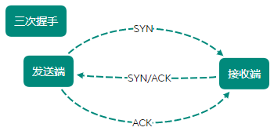
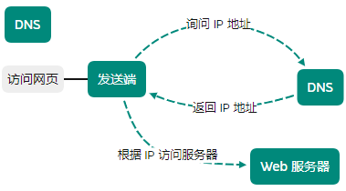

[TOC]

# IP/TCP/DNS

## IP

IP（网际协议），位于网络层，协议名称占据一般位置

把各种数据包传送给对方，保证传送到对方则需要满足各类条件

- IP 地址

    指明节点被分配到的地址

- MAC 地址

    网卡所属的固定地址
    
IP 地址和 MAC 地址进行配对，**IP 可变换，但 MAC 不会更改**

**ARP 协议借 MAC 地址进行通信**

IP 通信依赖 MAC，经过多台计算机和网络设备中转连接对方，进行中转时，利用下一站中转设备的 MAC 地址搜索下一个中转目标

**ARP 协议（解析地址）** 根据通信方的 IP 地址可反查对应的 MAC 地址

> 路由选择：在到达通信目标前的中转过程中，计算机和路由器等网络设备只能获悉粗略的传输路线

## TCP

提供可靠的字节流服务，位于传输层

字节流服务：将大块数据分割成以报文段（segment）为单位的数据包进行管理

可靠传输：为了传送大数据把数据分割，TCP 协议确认数据最终是否到达对方设备

- 发送端发送带 SYN 标志的数据包给对方
- 接收端收到后，回传带 SYN/ACK 标志的数据包以示传达确认信息
- 发送端再次回传带有 ACK 标志的数据包，代表 “握手结束”

> 若在握手过程中某个阶段莫名中断，TCP 协议以相同顺序发送相同数据包

## DNS

提供域名到 IP 地址之间的解析服务，位于应用层

用户通常使用主机名或域名访问对方计算机，而不是直接通过 IP 地址访问

通过域名查找 IP 地址，或逆向从 IP 地址反查找域名的服务

