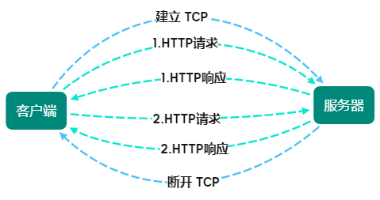
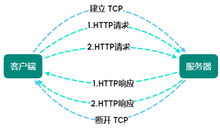
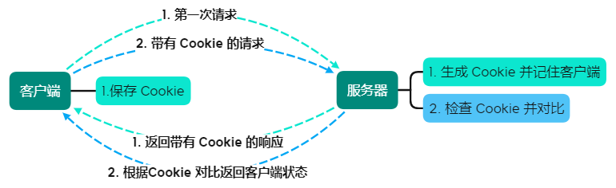

[TOC]

# HTTP 协议结构

- 客户端：请求访问文本或图像等资源的一端
- 服务器：提供资源响应的一端

> 按实际情况，两台计算机作为客户端或服务器的角色可能会互换，
> 
> 但仅从一条通信路线来说，服务器和客户端的角色的确定的。
> 
> **HTTP协议能明确哪端是客户端或服务器**


## 请求和响应


HTTP 协议规定，请求从客户端发出，最后服务器响应请求并返回对应资源

- 请求头

请求报文由请求方法、请求URI、协议版本（可选的请求首部字段和内容实体构成）

```markdown
GET / HTTP/1.1
|       |—— HTTP 版本号，提示客户端使用的协议功能
|—— 请求访问服务器的方法
Host: www.baidu.com
—————————— 请求首部字段 ——————————————————
Connection: keep-alive
...
```

- 响应头

响应报文由协议版本、状态码、用以解释状态码的原因短语（可选的首部字段以及实体主体）

```markdown
HTTP/1.1 200 OK
|         |   |—— 状态码提示
|         |—— 状态码
|—— 协议版本
—————————— 响应首部字段 ——————————————————
Connection: keep-alive
Content-Type: text/html;charset=utf-8
Date: Wed, 04 Aug 2021 21:43:37 GMT
...
```

## 请求 URI 定位资源

HTTP 协议使用 URI 定位互联网上的资源

当客户端请求访问资源而发送请求时，URI 需要将作为请求报文中的请求 URI 包含在内

- 完整 URI 的请求
  
    ```GET http://example.com/index.html HTTP/1.1```
  
- 在首部字段 Host 中写明网络域名或 IP 地址
    ```shell
    GET /index.html HTTP/1.1
    Host: example.com
    ```
  
> 如果不是访问特定资源而是对服务器本身发起请求，可用 `*` 代替请求 URI
> 
> ```shell
> OPTIONS * HTTP/1.1
> ```

## HTTP 方法

通过方法指定请求的资源按期望产生某种行为

- GET：获取资源（明文）
  
    用来请求访问已被 URI 识别的资源，指定的资源经服务器解析后返回响应内容
  
    - 文本：保持原样返回，HTML页面资源
    - CGI（通用网关接口）：返回经过执行后的输出结果，返回更新后的 HTML 页面资源，未更新则 304 作为响应返回
    
- POST：传输实体主体

    功能与 GET 相似，但并不获取响应的主体内容，用于表单提交或登录注册等操作
  
- PUT、DELETE：传输/删除文件
 
    **按指定请求的 URI 保存/删除 文件**
    
    > HTTP/1.1 的 PUT/DELETE 方法自身不带验证机制，存在安全性问题
    >
    > 配合 Web 应用程序的验证机制或架构设计采用 REST 同类网站，可开放使用 PUT/DELETE 方法
  
- HEAD：获得报文首部

    用于确认 URI 有效性及资源更新的日期时间等
  
- OPTIONS：询问支持的方法

    用来查询针对请求 URI 指定的资源支持方法
  
- TRACE：追踪路径

    让服务器将之前的请求通信还回给客户端
  
    > 发送请求时，在 Max-Forwards 首部字段中填入数值，每经一个服务器将该值减 1，当数值为 0 时停止传输
    >
    > 最后接收到请求的服务器返回 200 OK 响应
    >
    > **查询发送的请求是怎样被加工修改/篡改的，用来确认连接过程中发生的一系列操作**
    >
    > **注意：可能会引发 跨站追踪 攻击**，因此**不常用**
  
- CONNECT：在与代理服务器通信时建立隧道，实现隧道协议进行 TCP 通信

    - SSL（安全套接层）
    - TLS（传输层安全）
    
    通过 SSL、TLS 把通信内容加密后经网络隧道传输
    
    ```shell
    CONNECT 代理服务器名：端口号  HTTP版本
    ```
  
## 持久化连接

HTTP 协议初始版本中，没进行一次 HTTP 通信就要断开一次 TCP 连接

**每次请求都会造成无谓的 TCP 连接建立和断开，增加通信量开销**

### 持久连接

HTTP/1.1 通过称为 （`HTTP keep-alive` 或 `HTTP connection reuse`） 的方法，
只要任意一端没有明确提出断开连接，则保持 TCP 连接状态



> 好处：减少 TCP 连接的重复建立和断开所造成的额外开销，减轻服务器的负载
> 
> HTTP/1.1 中，所有连接默认都是持久连接

### 管线化

同时并行发送多个请求，而不需要一个一个地等待响应



> 管线化比持久连接快，请求数越多，时间差就越明显

## Cookie

HTTP 是 无状态 协议，对于发送过的请求或响应不做持久化处理，无法根据之前的状态进行本次的请求处理

每当新的请求发送时，就会有对应的新响应产生

随着 Web 发展，无状态导致了业务处理变的棘手而引入了 Cookie 技术

Cookie 通过在请求和响应报文中写入 Cookie 信息控制客户端的状态

- 根据从返回的响应内的 `Set-Cookie` 的首部字段信息通知保存 Cookie
- 当下次发送请求时，客户端自动在请求报文中加入 Cookie 值
- 服务器发现请求的 Cookie 后，检查并对比记录，最后得到之前额状态信息

