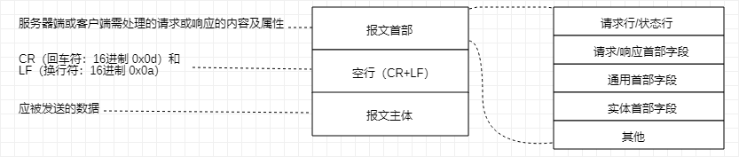

[TOC]

# HTTP 报文信息

HTTP 通信过程包括从客户端发往服务器端的请求及从服务器端返回客户端的响应

用于 HTTP 协议交互的信息被称为 HTTP 报文

- 请求报文：请求端（客户端）的HTTP报文
- 响应报文：响应端（服务器端）的HTTP报文

大致分为 **报文首部** 和 **报文主体** 两块



- 请求行：用于请求的方法，请求 URI 和 HTTP 版本
- 状态行：表明响应结果的状态码，原因短语和 HTTP 版本
- 首部字段：包含表示请求和响应的各种条件和属性的各类首部（通用、请求、响应、实体）
- 其他：可能包含 HTTP 的 RFC 未定义的首部（Cookie 等）

## 编码提升传输速率

HTTP 在传输数据时可按照数据原貌直接传输，也可在传输过程中通过编码提升传输速率

**通过在传输时编码，有效地处理大量的访问请求，编码操作需计算机完成，会消耗更多的 CPU 等资源**

### 报文和实体主体差异

- 报文（message）：HTTP 通信中的基本单位，由 8 位组字节流组成，通过 HTTP 通信传输

  用于传输请求或响应的实体主体

- 实体（entity）：作为请求或响应的有效载荷数据（补充项）被传输，其内容由实体首部和实体主体组成

  报文主体等于实体主体，**只有当传输中进行编码操作时，实体主体的内容发生变化，才导致和报文主体产生差异**

### 压缩传输的内容编码

内容编码：指明应用在实体内容上的编码格式，并保持实体信息原样压缩，编码后的实体由客户端接收并负责解码

常用内容编码有以下几种：

- gzip（GNU zip）
- compress（UNIX 系统的标准压缩）
- deflate（zlib）
- identity（不进行编码）

### 分割发送的分块传输编码

在通信过程中，请求的编码实体资源尚未全部传输完成之前，浏览器无法显示请求页面

**在传输大容量数据时，通过把数据分割成多块，能逐步显示页面**

把实体主体分块的功能称为：**分块传输编码**

- 分块传输编码将实体主体分成多个部分（块：十六进制标记块的大小）
- 实体主体最后一块使用 “0（CR+LF）” 标记
- 分块传输编码的实体主体由接收的客户端负责解码
- 恢复编码前的实体主体

> HTTP/1.1 存在称为**传输编码**机制，在通信时按某种编码方式传输，但只定义作用于分块传输编码中

## 发送多种数据的多部分对象集合

发送邮件时，可添加多份附件，采用了 MIME（多用途因特网邮件扩展）机制，允许邮件处理文本、图片、视频等多个不同类型的数据

> 图片等二进制数据以 ASCII 码字符串编码的方式指明，利用 MIME 描述标记数据类型
>
> 而 MIME 扩展中会使用称为 **多部分对象集合** 的方法容纳多份不同类型的数据

HTTP 协议中也采纳了多部分对象集合，发送的一份报文主体可含有多类型实体（在图片或文本文件等上传时使用）

- multipart/form-data：Web 表单文件上传时使用

```shell
Content-Type: multipart/form-data; boundary=AaB03x --AaB03x
Content-Disposition: form-data; name="field1"
Joe Blow
--AaB03x 
Content-Disposition: form-data; name="pics"; filename="file1.txt" 
Content-Type: text/plain

...（file1.txt的数据）...
--AaB03x--
```

- multipart/byteranges：状态码 206 响应报文包含了多个范围的内容时使用

```shell
HTTP/1.1 206 Partial Content

Date: Fri, 13 Jul 2012 02:45:26 GMT
Last-Modified: Fri, 31 Aug 2007 02:02:20 GMT
Content-Type: multipart/byteranges; boundary=THIS_STRING_SEPARATES

--THIS_STRING_SEPARATES
Content-Type: application/pdf
Content-Range: bytes 500-999/8000

...（范围指定的数据）...
--THIS_STRING_SEPARATES
Content-Type: application/pdf
Content-Range: bytes 7000-7999/8000

...（范围指定的数据）...
--THIS_STRING_SEPARATES--
```

HTTP 报文中使用多部分对象集合时，需要在首部字段里加上 `Content-type`

使用 `boundary` 字符串划分多部分对象集合指明的各类实体

- 指明各个实体的起始行之前插入 `--` 标记
- 在多部分对象集合对应的字符串的最后插入 `--` 标记

> 多部分对象集合的每个部分类型中，都可含有首部字段，可在某个部分嵌套多部分对象集合

## 获取部分内容范围请求

以前不能使用高速带宽访问互联网时，下载稍大图片或文件很吃力，下载过程遇到网络中断请求，须重头开始

解决上述问题：可恢复机制（能从之前下载中断处恢复下载）

实现该功能需要指定下载的实体范围，**指定范围发送的请求叫做范围请求**

```shell
# 执行范围请求时，会用到首部字段 Range 指定资源的 byte 范围
# 5001~10000 字节
Range: bytes=5001-10000

# 5001 字节之后全部
Range: bytes=5001-

# 从一开始到3000字节和5000~7000字节的多重范围
Range: bytes=-3000, 5000-7000
```

> 针对范围请求：响应会返回状态码为 `206 Partial Content` 响应报文
> 
> 对于多重范围的范围请求，响应会在首部字段 `Content-Type` 标明 `multipart/byteranges` 后返回响应报文
> 
> 如果服务器无法响应范围请求，则会返回状态码 200 OK 和完整实体内容

## 内容协商返回合适内容

内容协商：当浏览器默认语言为英文或中文，访问相同 URI 的 Web 页面时，则会显示对应语言的语言

客户端和服务器响应的资源内容进行交涉，然后提供给客户端最为适合的资源，会以响应资源的语言、字符集、编码方式等作为判断基准

- Accept
- Accept-Charset
- Accept-Encoding
- Accept-Language
- Content-Language

**内容协商技术以下3种类型**

- 服务器驱动协商（Server-driven）
  
  由服务器进行内容协商，以请求为首部字段参考，在服务器端自动处理

  **对用户以浏览器发送的信息作为判定依据，不一定能筛选出最优内容**

- 客户端驱动协商（Agent-driven）
  
  由客户端进行内容协商，用户从浏览器显示的可选项列表中手动选择 或 利用 JavaScript 在页面上自动进行上述选择
  
  **比如按照 OS 的类型 或 浏览器类型，自行切换 PC 或 手机版页面**

- 透明协商（Transparent）

  服务器驱动和客户端驱动的结合体，由服务器和客户端各自进行内容协商