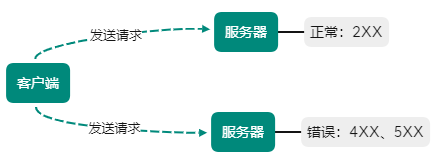

[TOC]

# HTTP 状态码

负责表示客户端 HTTP 请求的返回结果、标记服务器端处理是否正常、通知出现的错误等工作

状态码：当客户端向服务器发送请求时，描述返回的请求结果

> 借助状态码，判断服务器是否正确处理请求，或出现了何种错误

**状态码类别**

| | 类别 | 原因短语 |
| --- | --- | --- |
| 1XX | Informational（信息性） | 接收的请求正在处理 |
| 2XX | Success（成功） | 请求正常处理完毕 |
| 3XX | Redirection（重定向） | 需要进行附加操作以完成请求 |
| 4XX | Client Error（客户端错误） | 服务器无法处理请求 |
| 5XX | Server Error（服务器错误） | 服务器处理请求错误 |

> 记录在 RFC[2616](https://www.ietf.org/rfc/rfc2616.txt) 上的 HTTP 状态码达 40 中
> 
> 加 WebDAV （基于万维网分布创作和版本控制）（RFC[4918](https://www.ietf.org/rfc/rfc4918.txt) 、[5842](https://www.ietf.org/rfc/rfc5842.txt) ）和附加 HTTP 状态码（ RFC[6585](https://www.ietf.org/rfc/rfc6585.txt) ） 等扩展达 60 种
> 
> 经常使用的大概只有 14 种

## 2XX 成功

2XX 响应结果表明请求被正常处理

- 200 OK
    
    表示从客户端发来的请求在服务器被正常处理

    - GET：对应请求资源的实体会作为响应返回
    - HEAD：对应请求资源的实体主体不随报文首部作为响应返回（即响应中只返回首部）

- 204 No Content

    表示服务器接收的请求已成功处理，但在返回的响应报文中不含实体的主体部分，**不允许返回任何实体主体**

    > 一般在只需从客户端往服务器发送信息，而对客户端不需要发送新信息内容情况下使用

- 206 Partial Content

    表示客户端进行范围请求，而服务器成功执行这部分的 GET 请求

    响应报文中包含由 `Content-Range` 指定范围的实体内容

## 3XX 重定向

3XX 响应结果表明浏览器需执行某特殊处理以正确处理请求

- 301 Moved Permanently：永久性重定向

    表示请求的资源已被分配了新的 URI，以后应使用资源现在所指向的 URI

    > 把资源对应的 URI 保存为书签，应按 Location 首部字段提示的 URI 重新保存

- 302 Found：临时性重定向

    表示请求的资源已被分配了新的 URI，希望用户（本次）能使用新的 URI 访问

    和 301 状态码相似，但 302 代表的资源不是被永久移动，只是临时性

    > 移动的资源对应的 URI 将来还有可能发生改变
    >
    > 用户把 URI 保存成书签，但不会像 301 出现时那样更新书签，而是保留返回 302 状态码页面对应的 URI

- 303 See Other

    表示由于请求对应的资源存在着另一个 URI，应使用 GET 方法定向获取请求资源

    和 302 有相同功能，**但 303 明确表示客户端应采用 GET 方法获取资源**
    
    > 当使用 POST 方法访问 CGI 程序，其执行后的处理结果是：
    >
    > 希望客户端能以 GET 方法重定向到另一个 URI 上去时，返回 303 状态码

> 注意：当 301、302、303 响应返回时，几乎所有浏览器都会将 POST 改成 GET，并删除请求报文内的主体，之后请求会自动再次发送
> 
> 301、302 标准是禁止将 POST 改成 GET，但实际使用时都会这么做

- 304 Not Modified

    表示客户端发送附带条件的请求时，服务器允许请求访问资源，但发生请求未满足条件的情况后，直接返回 304（服务器资源未改变，可直接使用未过期的缓存）

    > 返回时，不包含任何响应的主体部分，虽被划分在 3XX 类别中，但和重定向没有关系

- 307 Temporary Redirect：临时重定向

    与 302 相同含义，但 307 会遵照浏览器标准，不会从 POST 改成 GET，但对于处理响应时的行为，每种浏览器可能出现不同的情况

## 4XX 客户端错误

表明客户端是发生错误的原因所在

- 400 Bad Request

    表示请求报文中存在语法错误

    **当错误发生时，需修改请求的内容再次发送请求**

- 401 Unauthorized

    表示发送的请求需要有通过 HTTP 认证（BASIC、DIGEST）的认证信息，**若之前已进行过 1 次请求，则表示用户认证失败**

    > 返回含有 401 响应必须包含适用于被请求资源的 `WWW-Authenticate` 首部用以 质询（challenge） 用户信息
    >
    > 当浏览器初次接收 401 响应，会弹出认证用的对话窗口

- 403 Forbidden

    表明对请求资源的访问被服务器拒绝

    > 未获得文件系统的访问授权，访问权限出现某些问题（从未授权的发送源 IP 地址视图访问）等列举情况都可发送 403
  
- 404 Not Found

    表明服务器上无法找到请求的资源，也可在服务器拒绝请求且不说明理由时使用

## 5XX 服务器错误

表明服务器本身发生错误

- 500 Internal Server Error

    表明服务器在执行请求时发生错误，**也可能 Web 应用存在的 bug 或 某些临时故障**

- 503 Service Unavailable

    表明服务器暂时处于超负载或正在进行停机维护，现在无法处理请求

    **如果事先得知解除以上状态需要的时间，可写入 `Retry-After` 首部字段再返回给客户端**

> 状态码和状态不一致
>
> 不少返回的状态码响应都是错误的，但用户可能察觉不到这点（Web 应用程序内部发生错误，状态码依然返回 200 OK）