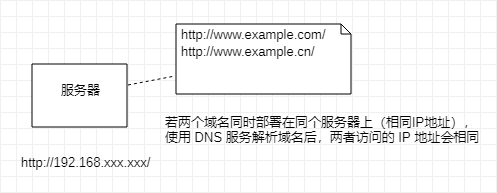
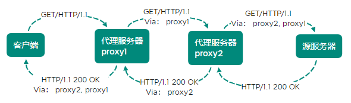
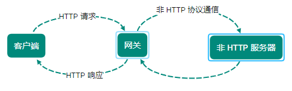
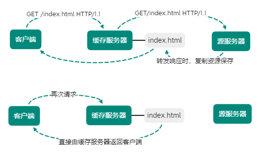
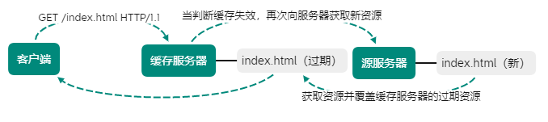

[TOC]

# 与 HTTP 协作的 Web 服务器

一台服务器可搭建多个独立域名的 Web 网站，也可作为通信路径上的中转服务器提升传输效率

## 单台虚拟主机实现多个域名

HTTP/1.1 规则允许一台 HTTP 服务器搭建多个 Web 站点

提供 Web 托管服务（Web Hosting Service）供应商

- 可以用一台服务器为多为客户服务
- 也可以以每位客户端持有的域名运行各自不同的网站

即使物理层面只有一台服务器，但只要使用虚拟主机功能，则可以假象具有多台服务器

互联网中，域名通过 DNS 服务映射到 IP 地址（域名解析）之后访问目标网站（当请求发送到服务器时，以 IP 地址形式访问）

如果一台服务器内托管了两个域名，当收到请求时需要弄清楚访问的是哪个域名

> 在相同 IP 地址下，由于虚拟主机可寄存多个不同主机名或域名的 Web 网站，
>
> **因此在发送 HTTP 请求时，必须在 Host 首部内完整指定主机名或域名的 URI**

## 通信数据转发程序：代理、网关、隧道

通信时，除客户端和服务器以外，还有一些用于通信数据转发的应用程序：代理、网关、隧道

应用程序和服务器可将请求转发给通信线路上的下一站服务器，并接收从那台服务器发送的响应再转发给客户端

- 代理
    
    转发功能应用程序，位于服务器和客户端 **中间人** 的角色

    接收由客户端发送的请求并转发给服务器，同时接收服务器返回的响应并转发给客户端

- 网关

    转发其他服务器通信数据的服务器，接收从客户端发送来的请求时，网关就像自己拥有资源的源服务器对请求进行处理

- 隧道

    在相隔远处的客户端和服务器两者之间进行中转，并保持双方通信连接的应用程序

### 代理

代理服务器基本行为：接收客户端发送的请求后转发给其他服务器

**代理不改变请求 URI，直接发送给前方持有资源的目标服务器**

持有资源实体的服务器称为：源服务器

从源服务器返回的响应经过代理服务器后再传给客户端

> 通信过程中，可级联多台服代理服务器，请求和响应的转发会经过数台类似锁链连接的代理服务器
> 
> 转发时，需附加 Via 首部字段以标记出经过的主机信息

使用代理服务器理由：**利用缓存技术减少网络带宽流量，组织内部针对特定网站的访问控制，以获取访问日志为主要目的等等**

代理有很多使用方法，按两种基准分类

- 是否使用缓存（缓存代理）

    代理转发响应时，缓存代理预先将资源的副本（缓存）保存再代理服务器上

    **当代理再次接收相同资源请求时，就可以将之前缓存的资源作为响应返回**

- 是否修改报文（透明代理）

    转发请求或响应时，不对报文做任何加工的代理类型被称为透明代理

    **反之对报文内容进行加工的代理称为 非透明代理**

### 网关

工作机制和代理相似，而网关能使通信线路上的服务器提供非 HTTP 协议服务

利用网关能提高通信安全性，在客户端与网关之间的通信线路上加密以确保连接的安全

- 网关连接数据库，使用 SQL 语句查询数据
- 在 购物网站 上进行结算时，网关可和信用卡结算系统联动

### 隧道

按要求建立起一条与其他服务器的通信线路，使用 `SSL` 等手段进行通信

**确保客户端与服务器进行安全通信**

> 隧道本身不会解析 HTTP 请求，请求保持原样中转给之后的服务器，隧道在通信双方断开连接时结束

## 保存资源的缓存

缓存：代理服务器或客户端本地磁盘内保存的资源副本

> 利用缓存减少源服务器的访问，节省通信流量和通信时间

缓存服务器是代理服务器的一种，归类在缓存代理类型中

当代理转发从服务器返回响应时，代理服务器将会保存一份资源的副本

> 利用缓存可避免多次从源服务器转发资源
> 
> 因此客户端可就近从缓存服务器上获取资源，而源服务器不必多次处理相同请求

### 缓存有效期限

缓存服务器即使存在缓存，也会因为客户端的要求、缓存的有效期限等因素，向源服务器确认资源的有效性

**若判断缓存失效，缓存服务器将会再次从源服务器获取新资源**

### 客户端缓存

缓存也可存在客户端中，称为 **临时网络文件**

浏览器缓存如果有效，就不必再向服务器请求相同资源，直接从本地磁盘内读取

当判定缓存过期后，会向源服务器确认资源有效性，若判断浏览器缓存失败，会再次请求新资源

> HTTP 出现之前的协议
>
> 在 HTTP 规范确立之际，制定者参考那些协议的功能

- FTP

    传输文件时的协议，历史久远，可追溯 1973 年前后，比 TCP/IP 协议族的出现还早，仍广泛沿用

- NNTP

    用于 NetNews 电子会议室内传送消息的协议，在 1986 年前后，属于较古老的一类协议，已不常使用

- Archie

    搜索 anonymous FTP 公开的文件信息协议，1990 年前后，已不常使用

- WAIS

    以关键词检索多个数据库使用的协议，1991 年前后，被HTTP替代，已不常使用

- Gopher

    查找与互联网连接的计算机内信息的协议，1991 年前后，被HTTP替代，已不常使用