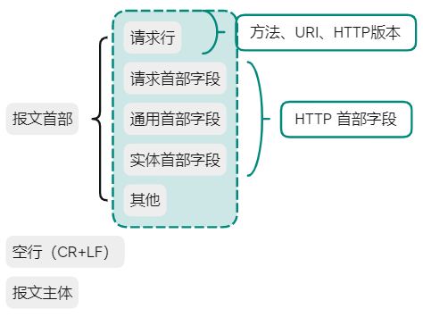

[TOC]

# HTTP 首部

HTTP 协议请求和响应报文中包含 HTTP 首部

- 首部内容：客户端和服务器分别处理请求和响应提供所需的信息
- 报文主体：包含需要的用户和资源信息

**请求报文**

请求中，报文由 **方法、URI、HTTP版本**、首部字段等部分组成



```shell
GET / HTTP/1.1
Host: iherberts.com
Connection: keep-alive
Pragma: no-cache
Cache-Control: no-cache
sec-ch-ua: "Chromium";v="92", " Not A;Brand";v="99", "Microsoft Edge";v="92"
sec-ch-ua-mobile: ?0
DNT: 1
Upgrade-Insecure-Requests: 1
User-Agent: Mozilla/5.0 ...
```

**响应报文**

响应中，报文由 **HTTP版本、状态码**、首部字段等 3 部分组成


```shell
HTTP/1.1 200 OK
Server: nginx/1.18.0 (Ubuntu)
Date: Thu, 12 Aug 2021 19:53:49 GMT
Content-Type: text/html; charset=utf-8
Connection: keep-alive
```

> 首部字段同时存在于请求和响应报文内，并涵盖 HTTP 报文相关内容信息
> 
> 因 HTTP 版本或扩展规范的变化，首部字段可支持的字段略有不同

## HTTP 首部字段

### HTTP 首部字段传递重要信息

首部字段是构成 HTTP 报文的要素之一，起到传递额外重要信息的作用

> 首部字段是为了给浏览器和服务器提供报文主体大小、所使用的语言、认证信息等内容

### HTTP 首部字段结构

由首部字段名和字段值构成，中间由冒号 : 分隔

```shell
首部字段名: 字段值

# 表示报文主体对象类型
Content-Type: text/html

# 字段值对应单个 HTTP 首部字段可有多个值
Keep-Alive: timeout=15, max=100
```

> 首部字段重复
> 
> 规范内未明确，根据浏览器内部处理逻辑的不同，结果可能不一致
>
> - 优先处理第一次出现的首部字段
> - 优先处理最后出现的首部字段

### 4 种 HTTP 首部字段类型

根据实际用途分为 4 种类型

- 通用首部字段（General Header Fields）
    
    请求和响应报文两方都会使用的首部

- 请求首部字段（Request Header Fields）

    从客户端向服务器发送的请求报文时使用的首部（补充了请求的附加内容、客户端信息、响应内容相关优先级等信息）

- 响应首部字段（Response Header Fields）

    从服务器向客户端返回响应报文时使用的首部（补充了响应的附加内容、也会要求客户端附加额外的内容信息）

- 实体首部字段（Entity Header Fields）

    针对请求报文和响应报文的实体部分使用的首部（补充了资源内容更新时间等与实体有关的信息）

### HTTP/1.1 首部字段一览

HTTP/1.1 定义了 47 种首部字段

- 通用首部字段

| 首部字段名 | 说明 |
| --- | --- |
| Cache-Control | 控制缓存行为 |
| Connection | 逐跳首部、连接管理 |
| Date | 创建报文的日期时间，**消息被发送时的日期和时间（时间格式为 GMT）** |
| Pragma | 报文指令 |
| Trailer | 报文末端首部一览 |
| Transfer-Encoding | 指定报文主体的传输编码方式 |
| Upgrade | 升级为其他协议 |
| Via | 代理服务器相关信息 |
| Warning | 错误通知 |


- 请求首部字段

| 首部字段名 | 说明 |
| --- | --- |
| Accept | 用户代理可处理的媒体类型 |
| Accept-Charset | 优先的字符集 |
| Accept-Encoding | 优先的内容编码 |
| Accept-Language | 优先的语言（自然语言） |
| Authorization | Web认证信息 |
| Expect | 期待服务器的特定行为 |
| From | 用户的电子邮箱地址 |
| Host | 请求资源所在服务器 |
| If-Match | 比较实体标记（ETag） |
| If-Modified-Since | 比较资源的更新时间 |
| If-None-Match | 比较实体标记（与If-Match相反） |
| If-Range | 资源未更新时发送实体Byte的范围请求 |
| If-Unmodified-Since | 比较资源的更新时间（与If-Modified-Since相反） |
| Max-Forwards | 最大传输逐跳数 |
| Proxy-Authorization | 代理服务器要求客户端的认证信息 |
| Range | 实体的字节范围请求 |
| Referer | 对请求中URI的原始获取方，**浏览器应该在多少时间之后刷新文档，单位为秒** |
| TE | 传输编码的优先级 |
| User-Agent | HTTP 客户端程序的信息 |

- 响应首部字段

| 首部字段名 | 说明 |
| --- | --- |
| Accept-Ranges | 是否接受字节范围请求 |
| Age | 推算资源创建经过时间 |
| ETag | 资源的匹配信息 |
| Location | 令客户端重定向至指定URI，**进行重定向或在创建某个新资源时指定位置** |
| Proxy-Authenticate | 代理服务器对客户端的认证信息 |
| Retry-After | 对再次发起请求的时机要求 |
| Server | HTTP服务器安装信息，**服务器名称及版本** |
| Vary | 代理服务器缓存的管理信息 |
| WWW-Authenticate | 服务器对客户端的认证信息 |

- 实体首部字段

通信双方支持对响应头域的扩展，如果存在不支持的响应头域，一般作为实体头域处理

| 首部字段名 | 说明 |
| --- | --- |
| Status | 本次请求的状态码 |
| Allow | 资源可支持的HTTP方法，**服务器支持的请求方法（GET、POST 等）** |
| Content-Encoding | 实体主体适用的编码方式，**文档编码方法，只有在解码之后，才可得到 `Content-Type` 头指定的内容类型** |
| Content-Language | 实体主体的自然语言 |
| Content-Length | 实体主体的大小（单位：字节），**内容长度，只有当浏览器使用持久 HTTP 连接时才需要此数据** |
| Content-Location | 替代对应资源的URI |
| Content-MD5 | 实体主体的报文摘要 |
| Content-Range | 实体主体的位置范围 |
| Content-Type | 实体主体的媒体类型，**文档 MIME 类型，默认为 `text/plain`，但通常需要显式指定为 `text/html`** |
| Expires | 实体主体过期的日期时间，**指定日期/时间，超过该时间则认为此回应已经过期** |
| Last-Modified | 资源的最后修改日期时间，**所请求的对象的最后修改日期** |

### 非 HTTP/1.1 首部字段

HTTP 协议通信交互种使用到的首部字段，不限于 [RFC2616](https://www.ietf.org/rfc/rfc2616.txt) 中定义的 47 种首部字段

还有 `Cookie`、`Set-Cookie` 和 `Content-Disposition` 等其他 RFC 定义的首部字段

> 非正式首部字段统一归纳在 [RFC4229](https://www.ietf.org/rfc/rfc4229.txt) 中

### 端到端 和 逐条首部

HTTP 首部字段将定义成 **缓存代理** 和 **非缓存代理** 的行为，分成两种：

**端到端首部（End-to-end Header）**

此类别中的首部会转发给 请求/响应 对应的最终接收目标，且必须保存在由缓存生成的响应中，规定必须被转发

**逐条首部（Hop-by-hop Header）**

此类别的首部只对单词转发有效，会因通过缓存或代理不再转发

> HTTP/1.1 和之后版本，使用 `hop-by-hop` 首部，需提供 `Connection` 首部字段

除了以下 8 个首部字段之外属于逐跳首部，其他都属于端到端首部

- Connection
- Keep-Alive
- Proxy-Authenticate
- Proxy-Authorization
- Trailer
- TE
- Transfer-Encoding
- Update