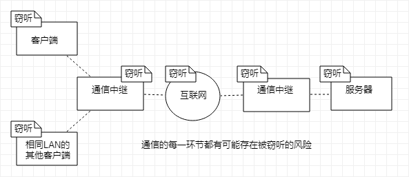
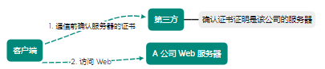
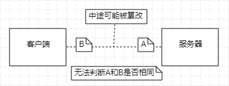
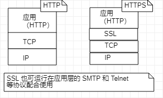
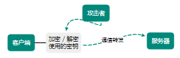
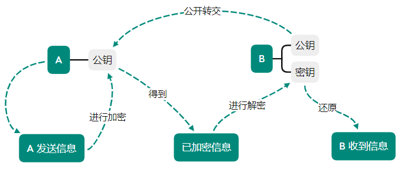
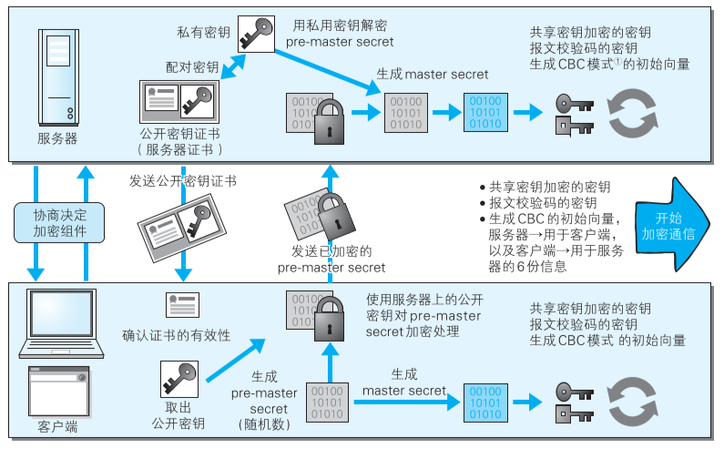

[TOC]

# 确保 Web 安全的 HTTPS

HTTP并非只有好的一面，事物皆具两面性

- 通信使用明文（不加密），内容可能被窃听
- 不验证通信方身份，可能遭遇伪装
- 无法证明报文的完整性，可能遭篡改

> 不仅在 HTTP 出现，其他未加密的协议也存在此类问题
>
> 也会像某些特定服务器和浏览器实际应用中存在的不足（安全漏洞）
> 
> Java 和 PHP 等等编程语言开发的 Web 应用也可能存在安全漏洞

## 通信明文被窃听

由于 HTTP 本身不具备加密功能，无法做到对通信整体进行加密（使用明文方式通信）

**TCP/IP 是可能被窃听的网络**

按 TCP/IP 协议族工作机制，通信内容在所有的通信线路上都有可能遭到窃听

互联网，由能连通全世界网络组成的，无论世界哪个角落的服务器和客户端通信时，在此通信线路上的某些网络设备、光缆、计算机等都不可能是个人私有物

**不排除某个环节中遭到恶意窃听行为**

即使是已经加密处理的通信，也会被窃听到通信内容，如果经过加密，可能让人无法破解报文信息的含义，但加密处理后的信息本身还是被探测并看到

窃听相同段的通信，只需要收集在互联网上流动的数据包（帧）

对于收集来的数据包解析工作，交给抓包（Packet Capture）或嗅探器（Sniffer）

**加密处理防止窃听**

- 通信加密

    将通信加密，通过和 SSL（安全套接层）和 TLS（安全传输协议）组合使用，加密 HTTP 通信内容

    与 SSL 组合使用的 HTTP 被称为 HTTPS 或 HTTP over SSL

- 内容加密

    参与通信的内容本身加密方式，对 HTTP 协议传输内容本身加密，把 HTTP 报文所含的内容进行加密处理

    对 HTTP 报文进行加密处理后再发送请求

    > 前提要求客户端和服务器同时具备加密和解密机制，**不同于 SSL 或 TLS 将整个通信线路加密，仍有被篡改的风险**

## 通信身份遭伪装

由于不存在确认通信方的处理步骤，任何人都可发起请求

服务器只要接收到请求，不管对方是谁都会返回一个响应（仅限于发送端 IP 和端口号没被设定限制访问的前提）

- 无法确定请求发送至目标的服务器是否按要求返回响应的服务器（伪装服务器）
- 无法确定响应返回的客户端是否为接收响应的客户端（伪装客户端）
- 无法确定正在通信的双方具有访问权限（保存重要信息，只发生特定用户通信的权限）
- 无法判断请求来自何方
- 无法组织海量请求下的 DoS 攻击（拒绝服务攻击）

**SSL 查明证书**

HTTP 虽然无法确定通信方，但使用 SSL 可提供加密处理并使用证书的手段，用于确定方

证书由第三方信任机构颁发，用以证明服务器和客户端是实际存在的

通过使用证书，以证明通信方是实际服务器，减少个人信息泄露的危险性

> 客户端持有证书即可完成个人身份确认，也可用于对网站的认证环节

## 报文可能遭篡改

若无法证明信息的准确度，也就意味者无法判断信息是否准确

**接收到的内容可能有误**

在请求或响应送出之后直到对方接收之前，即使请求或响应内容遭到篡改，也无法获悉

无法确定客户端下载的文件和服务器存放的文件是否前后一致，中途可能被篡改

> 请求或响应传输途中，遭攻击者拦截并篡改内容攻击称为 **中间人攻击（Man-in-the-Middle, MITM）**

**防止篡改**

常用 MD5 和 SHA-1 等散列值校验方法，以及用来确认文件的数字签名方法

提供文件下载服务的网站会提供 PGP（完美隐私）创建的数字签名及 MD5 算法生成的散列值

- PGP：证明创建文件的数字签名
- MD5：由单向函数生成的散列值

> 也无法百分百保证确认结果正确，PGP 和 MD5 也存在被改写的可能
> 
> 可通过 HTTPS，SSL 提供认证和解密处理及摘要功能，通过和其他协议组合使用实现目标

## HTTPS 完整加密处理

统一解决上述问题，需在 HTTP 上再加入加密处理和认证等机制

添加加密及认证的 HTTP 称为 HTTPS

使用 HTTPS 通信时，改用 `https://`

HTTPS 并非应用层的新协议，而是在通信接口部分用 SSL 和 TLS 协议代替

### 公开密钥加密

SSL 采用 **公开密钥加密** 加密处理方式，加密方法中加密算法是公开的，而密钥是保密的，
保持加密方法的安全性，**但密钥被攻击者获得，就失去了意义**

- 共享密钥加密困境

加密和解密同用一个密钥的方式称为 **共享密钥加密（对称密钥加密）**

> 以共享密钥方式加密时必须将密钥发给对方，在互联网上转发时，如果通信被监听那么密钥就会落入攻击者手上，失去了加密的意义

- 私钥和公钥

公开密钥加密使用一对非对称的密钥，私有密钥不能让其他任何人知道，公开密钥则可随意发布

发送密文的一方使用对方的公开密钥进行加密处理，对方收到被加密信息后，使用自己的私钥进行解密

> 根据密文和公开密钥，恢复信息原文异常困难，但解密过程是对离散对数进行求值
> 
> 如果对非常大的证书左到快速因式分解，那么密码破解还是存在希望

- HTTPS 采用混合加密机制

采用共享密钥加密和公开密钥加密两者并用的混合加密机制

**若密钥能实现安全交换**，那将考虑仅使用公开密钥加密来通信，可利用两者各自优势，将多种方法组合用于通信

> 在交换密钥环节使用公开密钥加密方式
> 
> 之后的建立通信交换报文阶段则使用共享密钥方式

### 证明公开密钥正确性证书

公开密钥加密方式存在：无法证明公开密钥本身是真实的密钥（可能在公开密钥传输中，被攻击者替换）

可使用数字证书认证机构和其相关颁发的公开密钥证书：

1. 服务器把自己公开密钥登录至数字证书认证机构
2. 数字证书机构用自己的私钥向服务器的公开密码署数字签名并颁发公钥证书
3. 客户端拿到公钥证书后，使用证书机构的验证公钥数字签名确认真实性
4. 使用服务器的公开密钥对报文加密后发送
5. 服务器使用私有对报文解密

### HTTPS 安全通信机制

通信步骤：

1. 客户端通过发送 `Client Hello` 报文开始的 SSL 通信

    包含客户端支持的 SSL 指定版本、加密组件列表（所使用的加密算法及密钥长度等）

2. 服务器进行 SSL 通信时，以 `Server Hello` 报文作文应答

   包含 SSL 版本以及加密组件（从接收的客户端加密组件内筛选出来）

3. 服务器发送 `Certificate` 报文

    包含公开密钥证书

4. 服务器发送 `Server Hello Done` 报文通知客户端

    最初阶段的 SSL 协商部分结束

5. SSL 握手结束，客户端以 `Client Key Exchange` 报文作回应

    包含通信加密中使用的称为 `Pre-master secret` 的随机密码串（已用步骤 3 中的公开密钥进行加密）

6. 客户端继续发送 `Change Cipher Spec` 报文

    提示服务器，在此报文之后的通信采用 `Pre-master secret` 密钥加密

7. 客户端发送 `Finished` 报文

    包含连接至今全部报文的整体校验值（握手协商成功与否取决于 以**服务器是否能正确解密该报文作为判定标准**）

8. 服务器同样发送 `Change Cipher Spec`  报文
9. 服务器同样发送 `Finished` 报文
10. 服务器和客户端的 `Finished` 报文交换完毕，SSL 连接建立完成

    从此处开始进行应用层协议的通信，发送 HTTP 请求

11. 应用层协议通信（发送HTTP响应）
12. 由客户端断开连接

    断开连接时，发送 `close_notify` 报文

> 步骤 12 之后再发送 TCP FIN 报文关闭与 TCP 的通信
> 
> **在应用层发送数据时会附加 MAC（Message Authentication Code） 的报文摘要，MAC 能查知报文是否遭到篡改，从而保护报文的完整性**

### SSL 和 TLS

SSL 最初由网景公司率先倡导，开发 SSL3.0 之前的版本，后面主导权转移 IETF 手中

IETF 以 SSL3.0 为基准，又制定了 TLS1.0、TLS1.1 和 TLS1.2

TLS 是以 SSL 为原型开发的协议，SSL1.0 和 SSL2.0 被发现存在问题，直接废除了该协议版本

**SSL 速度**

当使用 SSL 时，处理速度会变慢

1. 通信

    与 HTTP 相比，网络负载可能变慢 2 到 100 倍。除去和 TCP 连接、发送 HTTP 请求/响应以外，还须进行 SSL 通信

    **整体上处理通信量增加**

2. 硬件处理

    在服务器和客户端需要进行加密/解密的运算处理，比 HTTP 更多地消耗硬件资源，导致负载增强

    > 针对速度变慢，并没有根本性解决方案
    >
    > 可使用 SSL 加速器（专用服务器）硬件改善该问题，为 SSL 通信专用硬件
    > 
    > 相对软件，能够提高数倍 SSL 的计算速度，仅在 SSL 处理时发挥 SSL 加速器的功效以分担负载

> 为什么不一直使用 HTTPS
> 
> 与纯文本通信相比，加密通信会消耗更多的 CPU 及内存资源，每次通信都加密，会消耗相当多的资源
> 
> 如果是非敏感信息则使用 HTTP 通信，只有包含个人信息等敏感数据时，才利用 HTTPS 加密通信
