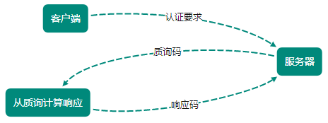

[TOC]

# 确认访问用户身份的认证

计算机本身无法判断使用者的身份

HTTP/1.1 使用的认证方式：

- BASIC 认证（基本认证）
- DIGEST 认证（摘要认证）
- SSL 客户端认证
- FormBase 认证（基于表单认证）
- Windows 统一认证（Keberos、NTLM）

## BASIC

从 HTTP/1.0 定义的认证方式，Web 服务器与通信客户端之间进行的认证方式

认证步骤：

1. 当请求资源需要 BASIC 认证时，服务器随状态码 `401 Authorization Required`，返回带 `WWW-Authenticate` 首部字段响应

    **该字段内包含认证方式（BASIC）及 Request-URI 安全域字符串（realm）**

2. 接收 401 状态码的客户端为了通过 BASIC 认证，需要将用户 ID 及密码发送给服务器

    发送的字符串内容是由 用户 ID 和密码认证，两者中间以冒号（：）连接后，再经 Base64 编码处理

    ```shell
    user:password  ==base64==>> dXNlcjpwYXNzd29yZA==
    ```
   
    将编码后的字符串写入首部字段 Authorization 后发送请求

3. 接收到包含首部字段 Authorization 请求的服务器，会对认证信息正确性进行验证，验证通过则返回 `Request-URI` 资源响应

> 注意：虽采用了 Base64 编码，但不是加密处理，不需要任何附加信息即可对其解码
> 
> BASIC 认证使用上不够便捷灵活，且达不到多数网站的安全性等级，因此不常用

## DIGEST

从 HTTP/1.1 定义，使用 `质询/响应` 的方式，为了弥补 BASIC 认证存在的弱点

质询/响应：

- 一开始一方会先发送认证要求给另一方
- 从另一方那接收到的质询码计算生成响应码
- 最后将响应码返回给对方进行认证（发送给对方的只是响应摘要及由质询码产生的计算结果）



认证步骤：

1. 请求需认证的资源时，服务器随状态码 401 Authorization Required，返回带 `WWW-Authenticate` 首部字段响应

   包含质问响应方式认证所需的临时质询码（随机数，nonce）

   `WWW-Authenticate` 包含 `realm` 和 `nonce` 两个字段，客户端依靠向服务器回送这两个值进行认证

   - nonce：每次随返回的 401 响应生成的任意随机字符串（推荐由 Base64 编码的十六进制数组成形式，实际内容依赖服务器具体实现）

2. 接收 401 状态码的客户端返回的响应包含 DIGEST 认证必须的首部字段 `Authorization` 信息

   首部字段 Authorization 内包含：

   - realm、nonce：之前从服务器接收到的响应字段
   - username：realm 限定范文内可进行认证的用户名
   - uri（digest-uri）：Request-URI 值，可能经代理转发后被修改，会提前复制一份副本保存在 uri 内
   - response（Request-Digest）：存放经过 MD5 运算后的密码字符串，形成响应码

   > 有关 Request-Digest 计算规则：[RFC2617](https://www.ietf.org/rfc/rfc2617.txt)

3. 接收到包含首部字段 `Authorization` 请求的服务器，会确认认证信息正确性

   认证通过后返回包含 `Request-URI` 资源的响应，会在首部字段 `Authorization` 写入认证成功相关信息

> 提供了防止密码被窃听的保护机制，但并不存在防止用户伪装的保护机制，相比 HTTPS 客户端认证仍很弱，适用范围也有所受限

## SSL

利用 SSL 客户端认证可避免第三者冒充情况

借由 HTTPS 客户端完成认证方式，凭借客户端证书，服务器可确认访问是否本人登录客户端

认证步骤：

1. 接收到需要认证资源的请求，服务器发送 Certificate Request 报文，要求客户端提供客户端证书
2. 用户选择发送的客户端证书后，把证书信息以 Client Certificate 报文方式发给服务器
3. 服务器验证客户端证书通过后方可领取证书内客户端的公开密钥，然后开始 HTTPS 加密通信

### 双因素认证

SSL 客户端一般会和基于表单认证组合形成双因素认证使用

认证过程中不仅需要密码，还需要申请认证者提供其他持有信息，与其组合使用

- SSL 客户端证书：认证客户端计算机
- 密码：确认用户是否本人行为

> 客户端证书需要支付一定费用才能使用，费用不尽相同
> 
> 从认证机构购买客户端证书的费用，以及服务器运营者为保证自己搭建的认证机构安全运营所产生的费用

## 基于表单认证

不是基于 HTTP 协议中定义的，客户端会向服务器上的 Web 应用程序发送登录信息，按登录信息的验证结果认证

**根据 Web 应用程序的实际安装，用户界面及认证方式也不同**

### 认证多半为基于表单认证

对于 Web 网站的认证功能，能够满足其安全使用级别的标准规范并不存在，只好使用由 Web 应用程序各自实现基于表单的认证方式

> 不具备共同标准规范的表单认证，在每个网站都会有不相同的实现方式，**表单认证的实现中也可能因业务逻辑关系产生安全问题**

### Session 管理及 Cookie 应用

基于表单认证本身是通过服务器的 Web 应用，将客户端发送过来的用户 ID 和密码与之前登陆过的信息做匹配进行认证

鉴于 HTTP 是无状态协议（无法实现状态管理），会使用 Cookie 来管理 Session，弥补不存在的状态管理功能

认证步骤：

1. 客户端把用户 ID 和密码等登录信息放入报文实体部分（以 POST 方法把请求发送给服务器）

2. 服务器发放以识别用户的 Session ID，通过验证从客户端发送的登录信息进行身份认证，然后把用户的认证状态与 Session ID 绑定后记录在服务器
   
   向客户端返回时，会在首部字段 `Set-Cookie` 内写入 Session ID

   > Session ID 应使用难以推测的字符串且服务器也需进行有效期管理，保证其安全性
   > 
   > 为减轻 XSS 造成的损失，可在 Cookie 内加上 `httponly` 属性

3. 客户端接收到从服务器发来的 Session ID 后，会将其作为 Cookie 保存在本地
   
   下次向服务器发送请求时，浏览器会自动发送 Cookie，服务器可通过验证接收的 Session ID 识别用户和其认证状态

> 注意：表单认证的登录信息及认证过程无标准化方法，服务器应如何保存等信息也没有标准化
> 
> 先利用给密码加盐（salt），增加额外信息，在使用散列（hash）函数计算出散列值后保存