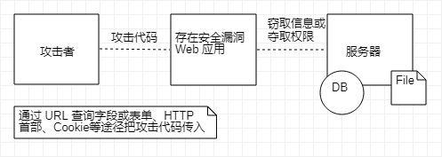
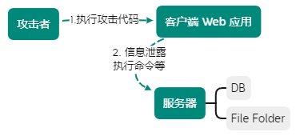
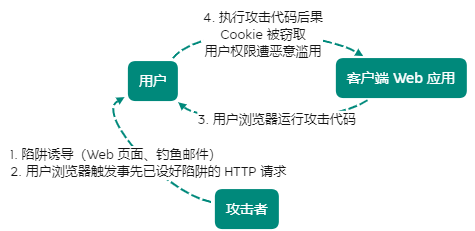

[TOC]

# Web 攻击技术

互联网攻击大多将 Web 站点作为目标，简单的 HTTP 协议本身不存在安全性问题，因此协议本身不会称为攻击对象

应用 HTTP 协议的服务器和客户端以及运行在服务器上的 Web 应用等资源是攻击目标

大多会使用会话（session）管理、加密处理等安全性方面功能，开发者需自行设计并开发及会话管理功能来满足 Web 应用的安全

## 客户端可篡改请求

Web 应用中，从浏览器接收 HTTP 请求内容，可在客户端自由变更、篡改

在 HTTP 请求报文内加载攻击代码，就可对 Web 应用攻击

**通过 URL 查询字段或表单、HTTP 首部、Cookie 等途径把攻击代码传入**

若应用存在安全漏洞，则内部信息就会遭窃取，或被攻击者拿到管理权限

## 针对 Web 的攻击模式

### 主动攻击

以服务器为目标的主动攻击：攻击者通过直接访问 Web 应用，把攻击代码传入的攻击模式

> 该模式直接针对服务器上的资源进行攻击，需能访问那些资源（SQL注入、OS命令注入）

### 被动攻击

被动攻击：利用圈套策略执行攻击代码的攻击模式

> 被动攻击过程中，攻击者不直接对目标 Web 应用访问发起攻击（XSS 脚本攻击、请求伪造）
>
> 1. 攻击者诱使用户触发已设置好的陷阱，陷阱会启动发送**已嵌入攻击代码的 HTTP 请求**
> 2. 当中招后，用户浏览器或邮件客户端就会触发陷阱
> 3. 中招的浏览器会**把含有攻击代码的 HTTP 请求** 发送给作为攻击目标的 Web 应用，运行攻击代码
> 4. 执行完后，存在安全漏洞的 Web 应用会称为攻击者的跳板，**导致用户所持的 Cookie 等个人信息被窃取，登录状态中的用户权限遭恶意滥用等后果**

**利用用户身份攻击企业内部网络**

利用被动攻击，可发起对原本从互联网上无法直接访问的企业内网等网络攻击

> **注意：只要用户踏入预先设好的陷阱，在用户能够访问到的网络范围内，企业内网也会收到攻击**
