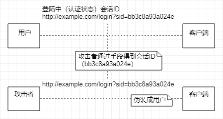
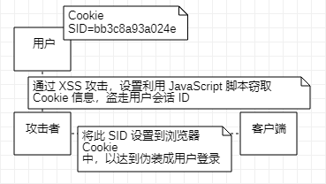
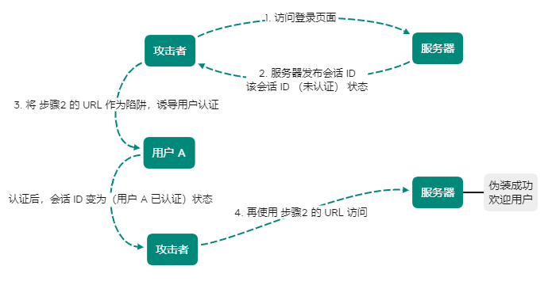
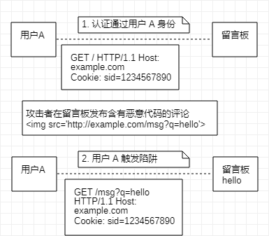

[TOC]

## 因会话管理疏忽引发的安全漏洞

会话管理：管理用户状态

> **如果会话管理上有所疏忽，会导致用户认证状态被窃取等后果**

### 会话劫持

攻击者通过某种手段拿到用户会话ID，并非非法使用此会话 ID 伪装成用户，达成攻击目标

具备认证功能的 Web 应用，使用会话 ID 的会话管理机制，作为管理认证状态

会话 ID 中记录客户端 Cookie 等信息，服务器将会话 ID 与认证状态进行一对一匹配管理：

- 通过非正规的生成方法推测
- 通过窃听或 XSS 攻击盗取
- 通过会话固定攻击（Session Fixation）强行获取

> 1. 在得知该网站存在可跨站攻击（XSS）安全漏洞后设置 JavaScript 脚本调用 `document.cookie` 窃取 Cookie 信息
> 2. 当用户访问该脚本后，获取含有会话 ID 的 Cookie
> 3. 拿到用户会话 ID 后，往浏览器 Cookie 设置该会话 ID ，即可伪装成会话 ID 遭窃的用户

### 会话固定攻击

强制用户使用攻击者指定的会话 ID （被动攻击）

**Session Adoption**

PHP 或 ASP.NET 能够接收处理未知会话 ID 的功能

> 恶意使用该功能可跳过会话固定攻击的准备阶段，从 Web 网站获得发行的会话 ID 步骤
> 
> 攻击者可私自创建会话 ID 构成陷阱，中间件会误以为该会话 ID 是未知会话 ID 而接收

### 跨站点请求伪造

攻击者通过设置好的陷阱，强制对已完成认证的用户进行非预期的个人信息或设定信息等某状态更新（被动攻击）

- 利用已通过认证的用户权限更新设定信息等
- 利用已通过认证的用户权限购买商品
- 利用已通过认证的用户权限在留言板发表言论

1. 受害者用户 A 是已认证状态，浏览器的 Cookie 持有的会话 ID 
2. 攻击者设置一旦用户访问，即发送非主观行为产生的评论的请求陷阱，用户A 浏览器执行完陷阱中请求，留言板将留下评论

> 如果用户 A 尚未通过认证，则无法利用用户 A 的身份权限在留言板上发表内容
