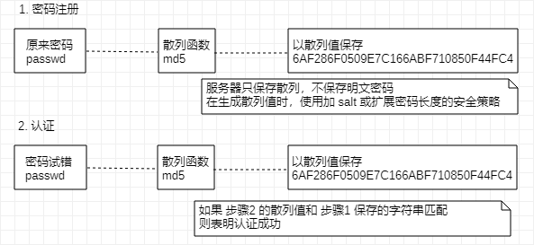
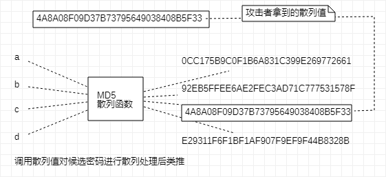

[TOC]

## 其他安全漏洞

### 密码破解

算出密码，突破认证，**不仅限 Web 应用，包括其他系统（FTP、SSH 等）**

- 通过网络的密码试错
- 对已加密密码破解
- SQL 注入攻击逃避认证
- 跨站脚本攻击窃取

#### 通过网络进行密码试错

- 穷举法

  对所有密钥集合构成的密钥空间（Keyspace）进行穷举

  用所有可行的候选密码对目标的密码系统试错，用以突破验证

  > **当密钥空间庞大时，解密需要花费数年，甚至千年时间**

- 字典攻击

  利用事先收集好的候选密码（经过各种组合方式后存入字典），枚举字典中的密码，尝试通过认证

  > **需要尝试的候选密码较少，意味者攻击耗费的时间较短，但字典中没有正确密码，就无法破解成功**

> **利用泄露的 ID - 密码 进行攻击**
>
> **字典攻击中可利用其他 网站 已泄露的 ID 及密码列表进行的攻击，很多用户都习惯多个网站使用同样的 账号和密码**

#### 对已加密密码破解

保存密码时，一般不以明文保存，通过散列值函数来散列处理加 salt 手段对保存的密码本身加密

> **想要真正使用这些密码，必须先通过解码等手段，把加密处理的密码还原成明文形式**



**从加密的数据导出明文**

- 通过穷举法、字典攻击进行类推

  针对密码使用散列函数进行加密处理情况，采用穷举或字典攻击手法

  尝试调用相同的散列函数加密候选密码，然后把计算出的散列值与目标散列值匹配，类推出密码

  

- 彩虹表

  由明文密码及其对应的散列值构成数据库表

  通过事先制作好的表，在穷举、字典攻击等实际破解过程中缩短消耗时间

  > 可通过 [Free Rainbow Tables](https://freerainbowtables.com/) 公布的彩虹表

- 拿到密钥

  使用共享密钥加密方式对密码数据进行加密处理情况下，通过某种手段拿到加密使用的密钥，对密码进行解密

- 加密算法漏洞

  考虑到加密算法本身存在漏洞，利用该漏洞尝试解密（找到广泛使用的加密算法漏洞，困难不宜成功）

  > 而 Web 应用开发者独立实现的加密算法，可能未经过充分验证，可能存在漏洞

### 点击劫持

也成界面伪装，通过利用透明的按钮或链接做成陷阱，覆盖页面上，诱使用户在不知情的情况下，点击链接访问内容

当用户点击透明按钮时，实际点击了已指定的透明属性元素的 `iframe` 页面


攻击者在预料会员点击的页面上设下陷阱，通过目标功能页面作为透明层覆盖在钓鱼网页上，覆盖时保证钓鱼按钮与登录注册按钮所在位置保持一致

```html
<iframe id="target" src="http://sns.example.com/leave"
        style= "opacity:0;filter:alpha(opacity=0)"></iframe>
<button style="position:absolute;top:100;left:100;z-index:-1">PLAY</button>
```

> 由于 SNS 网站作为透明层覆盖目标网站，SNS 网站上处于登录状态的用户访问钓鱼网站并点击页面上的按钮后，等同于点击了 SNS 的功能按钮

### DoS攻击

服务停止或拒绝服务：让运行中的服务呈停止状态攻击，**不仅限网站，也包括网络设备及服务器等**

- 集中利用访问请求造成资源过载，资源用尽的同时，实际服务也呈停止状态
- 通过攻击安全漏洞使服务停止

集中利用访问请求的 DoS 攻击，单纯发送大量合法请求，服务器很难分辨正常、攻击请求

> 多台计算机发起的 Dos 攻击称为 DDos 攻击
> 
> **利用感染病毒的计算机作为攻击者的攻击跳板**

### 后门程序

开发设置的隐藏入口，可不按正常步骤使用受限功能，**利用后门程序使用原本受限的功能**

- 开发阶段作为 Debug 调用的后门
- 开发者为了自身利益植入的后门
- 攻击者通过某种方法设置的后门

> 可通过监视进程和通信的状态发现被植入的后门程序
> 
> **但设定在 Web 应用中的后门程序，由于和正常使用时区别不大，通常很难发现**