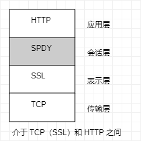
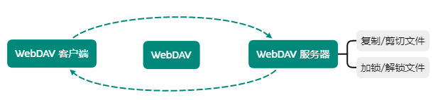
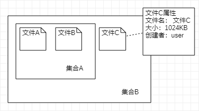

[TOC]

# 基于HTTP 功能追加协议

建立 HTTP 标准归规范时，制定者主要想把 HTTP 当作传输 HTML 文档的协议

随着时代发展，Web 用途具有多样性，网站所追求的功能通过 Web 应用和脚本程序实现

> 因为 HTTP 协议上的限制以及自身性能有限
> 
> 功能上的不足通过创建一套全新的协议来弥补


## SPDY

Google 在 2010 发布，目标：解决 TTP 性能瓶颈，缩短页面加载时间

维基百科：https://zh.wikipedia.org/zh-hans/SPDY

> **2015.9：Google 移除对 SPDY 支持，改支援 HTTP/2**

Ajax 和 Comet 等技术一定程度上使 HTTP 得到改善，但 HTTP 协议本身限制也束手无策

### SPDY 设计与功能

SPDY 没有完全改写 HTTP 协议，而是在 TCP/IP 应用层与传输层之间通过新加会话层形式运作



- 多路复用流：

    通过单一 TCP 连接，无线制处理多个 HTTP 请求，**都在一条 TCP 连接完成，处理效率得到提高**

- 赋予请求优先级

    无限制并发处理请求，给请求逐个分配优先级顺序，**在发送多个请求时，解决因带宽低而导致响应变慢的问题**

- 压缩 HTTP 首部

    压缩 HTTP 请求和响应首部，**减少通信产生的数据包数量和发送的字节数**

- 推送功能

    支持服务器主动向客户端推送数据功能，**服务器可直接发送数据，而不必等待客户端请求**

- 服务器提示功能

    服务器主动提示客户端请求所需资源，**在资源已缓存等情况下，可避免发送不必要的请求**

> 因为 SPDY 基本只是将单个域名（IP）通信多路复用，所以当一个网站使用多个域名下资源，改善效果将受到限制
> 
> **很多网站并非仅仅是 HTTP 瓶颈导致，对速度提升，应用从细致钻研的地方入手**
> 
> 改善 Web 内容编写方式等等

### HTTP 瓶颈

为了实时显示更新内容，服务器上有内容更新，就需要直接把内容反馈到客户端界面上，但 HTTP 无法妥善处理

> 使用 HTTP 协议探知服务器是否内容更新，就必须频繁从客户端到服务器进行确认，
> 
> 如果服务器上没有内容更新，就会产生多余通信

- 一条连接上只可发送一个请求
- 请求只能从客户端开始，不可以接收初响应以外的指令
- 请求/响应首部未经压缩就发送，首部信息越多延迟越大
- 发送冗长的首部。每次互相发送相同的首部造成的浪费较多
- 可任意选择数据压缩格式，非强制压缩发送

### Ajax

利用 JavaScript 和 DOM 操作，达到局部 Web 页面替换加载的异步通信手段

**只更新部分页面，响应中传输的数据量因此减少**

> 通过 JavaScript 脚本调用和服务器进行 HTTP 通信，从已加载完毕的 Web 页面上发起请求，只更新局部页面
> 
> 利用 Ajax 实时获取内容，也有可能导致大量请求产生

### Comet

一旦服务器有内容更新，Comet 不会让请求等待，而是直接给客户端返回响应

**通过延迟应答，模拟实现服务器向客户端推送的功能**

- 正常通信

    服务器接收到请求，在处理完毕后就会立即返回响应

- 延迟通信

    Comet 先将响应置于挂起状态，
    当服务器有内容更新时，返回该响应（服务器有更新，就立即反馈给客户端）

> 虽可以实时更新，为了保留响应，一次连接的持续时间也变长了
> 
> 为了维持连接会消耗更多资源，Comet 仍未解决 HTTP 协议存在的问题

## WebSocket

WebSocket 通信：在 Web 浏览器与 Web 服务器之间全双工通信标准

WebSocket 由 IETF 定位标准，WebSocket API 由 W3C 定位标准

解决 Ajax 和 Comet 里 XMLHttpRequest 附带的缺陷所引起的问题

> 2011 年 12 月 11 日被收录 [RFC6455](https://www.ietf.org/rfc/rfc6455.txt) 

一旦服务器与客户端之间建立其 WebSocket 协议通信连接，之后所有通信都依靠专用协议进行

通信过程中互相发送 JSON、XML、HTML 或图片等任意格式数据

- 推送功能

    由服务器向客户端推送数据的推送功能，服务器可直接发送数据，不必等待客户端请求

- 减少通信量

    建立连接后，一直保持连接状态，和 HTTP 相比，每次连接时总开销减少，由于 WebSocket 首部信息小，通信量也响应减少

**握手 - 请求**

实现 WebSocket 通信，需要用到 HTTP 的 **`Upgrade` 首部字段，告知服务器通信协议与发生改变，达到握手目的**

```http request
GET /chat HTTP/1.1 
Host: server.example.com 
Upgrade: websocket 
Connection: Upgrade
Sec-WebSocket-Key: dGhlIHNhbXBsZSBub25jZQ==  // 记录握手过程不可少的键值
Origin: http://example.com
Sec-WebSocket-Protocol: chat, superchat  // 记录使用的子协议
Sec-WebSocket-Version: 13
```

> 子协议按 WebSocket 协议标准在连接分开使用时，定义那些连接的名称

**握手 - 响应**

对之前的请求，返回状态码 `101 Switching Protocols` 响应

```http request
HTTP/1.1 101 Switching Protocols 
Upgrade: websocket
Connection: Upgrade
Sec-WebSocket-Accept: s3pPLMBiTxaQ9kYGzzhZRbK+xOo=  // 由握手请求中的 `Sec-WebSocket-Key` 字段值生成
Sec-WebSocket-Protocol: chat
```

> 握手成功后，通信不再使用 HTTP 的数据帧，而采用 WebSocket 独立数据帧

### WebSocket API

JavaScript 可调用 [The Websocket API](https://developer.mozilla.org/en-US/docs/Web/API/WebSockets_API#:~:text=The%20WebSocket%20API%20is%20an%20advanced%20technology%20that,having%20to%20poll%20the%20server%20for%20a%20reply.) 内提供的 WebSocket 程序接口

以实现 WebSocket 协议下全双工通信

```javascript
// 调用 API ，每 50ms 发送一次数据
var socket = new WebSocket('ws://game.example.com:12010/updates'); 
socket.onopen = function () {
    setInterval(function() { 
        if (socket.bufferedAmount == 0)
            socket.send(getUpdateData());
    }, 50);
};
```

## HTTP/2.0

负责互联网技术标准的 IETF（互联网工程任务组）创立 httpbis 工作组，目标：推进下一代 HTTP —— HTTP2.0 实现标准化

HTTP2.0 特点：**改善用户在使用 Web 时的速度体验**

基本上先通过 HTTP1.1 与 TCP 连接，以下面协议为基础，探讨实现方法

- HTTP Speed + Mobility

    微软起草，用于改善并提高移动端通信时的通信速度和性能标准，建立在 SPDY 与 WebSocket 基础上

- Network-Friendly HTTP Upgrade

    在移动端通信时改善 HTTP 性能标准

**HTTP/2.0 的 7 项技术及讨论**

| 压缩 | SPDY、Friendly |
| --- | --- |
| 多路复用 | SPDY |
| TLS 义务化 | Speed + Mobility |
| 协商 | Speed + Mobility, Friendly |
| 客户端拉拽(Client Pull)/服务器推送(Server Push) | Speed + Mobility |
| 流量控制 | SPDY |
| WebSocket | Speed + Mobility |

## WebDAV

基于万维网的分布式创作和版本控制，对 Web 服务器上的内容直接进行文件复制、编辑等操作的分布式文件系统

除了创建、删除等基本功能，还具备文件创建者管理、文件编辑过程中禁止其他用户内容覆盖加锁功能，以及对文件内容修改版本控制



> 作为扩展 HTTP/1.1 的协议定义在 [RFC4918](https://www.ietf.org/rfc/rfc4918.txt)

针对服务器上的资源，WebDAV 新增加一些概念



- 集合（Collection）：统一管理多个资源概念，以集合为单位可进行各种操作，实现类似集合叠加
- 资源（Resource）：把文件或集合称为资源
- 属性（Property）：定义资源属性，定义以 `名称 = 值` 格式执行
- 锁（Lock）：把文件设置成无法编辑状态，多人同时编辑时，可防止同一时间进行内容写入

### 新增的方法及状态码

为实现远程文件管理，向 HTTP/1.1 追加以下方法

- PROPFIND：获取属性
- PROPPATCH：修改属性
- MKCOL：创建集合
- COPY：复制资源及属性
- MOVE：移动资源
- LOCK：资源加锁
- UNLOCK：资源解锁

为配合扩展方法，状态码也进行扩展

- 102 Processing：可正常请求（处理中状态）
- 207 Multi-Status：存在多种状态
- 422 Unprocessible Entity：格式正确，内容错误
- 423 Locked：资源已被加锁
- 424 Failed Dependency：处理与某请求关联的请求失败，因此不再维持依赖关系
- 507 Insufficient Storage：保存空间不足

### 请求响应实例

使用 `PROPFIND` 方法对 `http://www.example.com/file` 发起获取属性的请求

- 请求实例

```http request
PROPFIND /file HTTP/1.1 
Host: www.example.com
Content-Type: application/xml; 
charset="utf-8" Content-Length: 219

<?xml version="1.0" encoding="utf-8" ?> 
<D:propfind xmlns:D="DAV:">
    <D:prop xmlns:R="http://ns.example.com/boxschema/"> 
        <R:bigbox/> 
        <R:author/> 
        <R:DingALing/> 
        <R:Random/>
    </D:prop>
</D:propfind>
```

- 响应实例

```http request
HTTP/1.1 207 Multi-Status 
Content-Type: application/xml; 
charset="utf-8" 
Content-Length: 831

<?xml version="1.0" encoding="utf-8" ?> 
<D:multistatus xmlns:D="DAV:">
    <D:response xmlns:R="http://ns.example.com/boxschema/"> 
        <D:href>http://www.example.com/file</D:href> 
        <D:propstat> 
            <D:prop>
                <R:bigbox>
                <R:BoxType>Box type A</R:BoxType> 
                </R:bigbox> <R:author>
                <R:Name>J.J. Johnson</R:Name> 
                </R:author>
            </D:prop>
        <D:status>HTTP/1.1 200 OK</D:status> 
        </D:propstat>
        <D:propstat>
            <D:prop>
            <R:DingALing/>
            <R:Random/>
            </D:prop> 
            <D:status>HTTP/1.1 403 Forbidden</D:status> 
            <D:responsedescription> The user does not have access to the DingALing property. 
            </D:responsedescription> 
        </D:propstat> 
    </D:response>
    <D:responsedescription> There has been an access violation error. </D:responsedescription>
</D:multistatus>
```