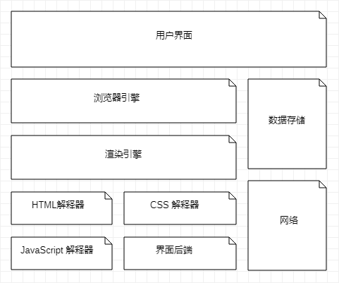
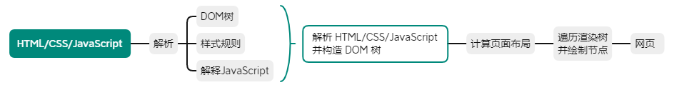

[TOC]

# 浏览器

网页：包含 HTML 标签的纯文本文件，构成 Web 应用的元素之一，还包含 JavaScript、CSS、图片和其他媒体等文件

发起网络请求，并将服务器返回的资源渲染成页面

爬虫程序可模拟浏览器向服务器发起网络请求，**反爬虫手段利用了浏览器和爬虫程序之间的差异**

### 浏览器主要结构



- 用户界面：包括地址栏、前进/后退/刷新等按钮、页面主窗口等
- 浏览器引擎：负责将用户的操作传递给对应的渲染引擎
- 渲染引擎：能调用解释器解释 HTML/CSS/JavaScript，根据解释结果重排页面并绘制渲染树
- HTML、CSS、JavaScript 解释器：解释前端代码
- 界面后端：绘制组合框和窗口啊等基本部件
- 数据存储：在本地存储一些体积较小的数据，如 Cookie、Storage 对象等
- 网络：自动加载 HTML 文档所需的其他资源

### 页面渲染

将资源从文本编程页面过程



1. 渲染引擎解析 HTML 文档并将其转换为 DOM 节点
2. 同时解析 CSS 文件和页面标签中的样式代码，**CSS**和**DOM**共同组成渲染树
3. 布局过程，每个节点确定浏览器中的具体位置
4. 绘制阶段，遍历渲染树并绘制每一个节点，绘制的结果显示屏幕

> **注意**：HTML 文档和 CSS 解析，可同时进行，解析工作和网络请求也有可能同时进行（渲染工作和资源加载工作是异步进行的）

### DOM

W3C 组织推荐的处理可扩展标志语言的标准编程接口

网页中，组织页面或文档的对象被放在**树形结构**中，用来表示对象的标准模型称为 DOM

能以**独立于平台和语言的方式**访问和修改**文档的结构**，表示和处理 HTML 或 XML 文档的常用方法，以 对象管理组织（OMG） 的规则为基础

> DOM 以面向对象的方式描述文档模型，定义表示和修改文档所需的对象名称、行为、属性和对象之间的关系

**HTML文档每个部分可看作一个节点**

- 整个 HTML 文档是一个文档节点
- 每个 HTML 标签是一个元素节点
- 包含在 HTML 元素中的文本是文本节点
- 每个 HTML 属性是一个属性节点
- 注释属于注释节点

**节点树与节点之间的关系**

HTML DOM 使 JavaScript 改变 HTML 事件，在事件发生时指定 JavaScript 代码

用户在页面上点击按钮或页面加载时，使用 JavaScript 改变网页显示内容的例子在 **页面加载时改变 DOM 位置**

> HTML DOM 为 JavaScript 提供了访问 HTML 中所有元素的入口，是开发者实现动态网页的前提

### BOM

浏览器提供的对象模型，通过它访问浏览器的属性或实现方法

1. window 对象

    浏览器窗口，所有浏览器均支持，并且所有 JavaScript 全局对象、函数以及变量自动成为该对象的成员

    全局变量是该对象的属性，全局函数则是该对象的方法

```javascript
document.write(window.innerHeight)  // 打印浏览器窗口内部高度
document.write("<br>")  // 打印换行符
document.write(window.innerWidth)  // 打印浏览器窗口内部宽度
```

2. window.navigator

    包含访问者浏览器的有关信息

    > 注意：对象的返回值是可改变的

3. window.location

    存储在 window 对象的 location 属性中，表示窗口当前显示的文档的 Web 地址

    用于表示浏览器当前显示的文档 URL （或位置），还能控制浏览器显示的文档位置

4. window.screen

    存放访问者浏览器的屏幕信息，JavaScript 可利用这些信息优化它们的输出，以达到用户的显示要求

5. window.history

    包含用户在浏览器窗口中访问过的 URL，该对象最初用来显示窗口的浏览历史，但出于隐私方面原因，不再允许脚本访问已访问过的实际 URL

> [MDN Window 对象文档](https://developer.mozilla.org/zh-CN/docs/Web/API/Window)