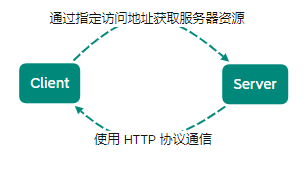
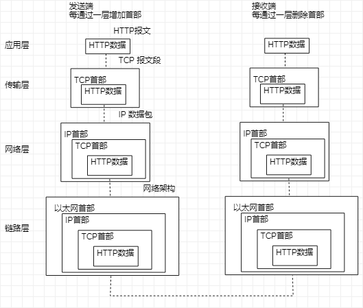
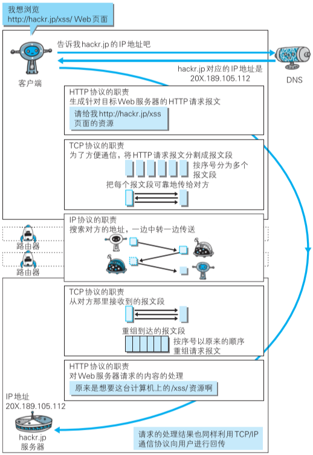

[TOC]

# 网站构成和页面渲染

由服务器和客户端组成：

- 服务器：负责为客户端提供文件资源提取和数据保存等服务
- 客户端：将服务器的资源转化为用户可读的内容

> 服务器与客户端之间信息交互通过**网络进行传输**，
> 网络传输根据对应的网络协议进行（**必须相同网络协议实现通信**）

## HTTP 访问 Web

- 根据 浏览器地址栏 指定 URL
- 浏览器从 Web 服务器端获取文件资源
- 显示 Web 页面

## HTTP 诞生

- HTTP/0.9
  于 1990 年问世，并没有作为正式标准被建立
  
- HTTP/1.0
  1996.5 正式作为标准被公布，并记载于 [RFC1945](http://www.ietf.org/rfc/rfc1945.txt)
  
- HTTP/1.1
  1997.1 目前主流 HTTP 协议版本，标准 [RFC2616](http://www.ietf.org/rfc/rfc2616.txt)
  
- HTTP/2.0
  标准 [RFC7540](https://www.ietf.org/rfc/rfc7540.txt)
  
## TCP/IP

通常使用的网络（互联网）在 **TCP/IP协议族** 基础上运作，**HTTP属于协议族的一个子集**

### TCP/IP 协议族

计算机与网络设备相互通信，双方必须基于相同方法

- 从电缆规格到 IP 地址的选定方法
- 寻找异地用户的方法
- 双方建立通信顺序
- Web页面显示需要处理步骤

### TCP/IP 分层管理

按层次分别：
- 应用层
  
    决定向用户提供应用服务时通信的活动
    预存各类通用应用服务
    - FTP（文件传输协议）
    - DNS（域名系统）

- 传输层
  
    提供处于网络连接中两台计算机之间数据传输
    - TCP（传输控制协议）
    - UDP（用户数据报协议）

- 网络层

    处理网络流动数据包
    规定通过传输路线到达对方计算机，并把数据包传送对方
    （在众多网络选项内选择一条传输路线）

- 数据链路层

  处理连接网络硬件部分
  - 控制操作系统、硬件的设备驱动
  - NIC（网络适配器）
  - 光纤等物理可见部分
  
### TCP/IP 通信传输流

发送端应用层往下，接收端则往应用层往上

- 客户端在应用层（HTTP）发出 Web 页面的 HTTP 请求
- 在传输层（TCP）把收到的数据（HTTP 请求报文）分割，并在各个报文打上标记序号及端口号后转发给网络层
- 网络层（IP）增加作为通信硬件（MAC）转发给链路层
- 服务器在链路层接收到数据，**按序往上层发送，直到应用层**

## 各种协议与 HTTP 协议关系

