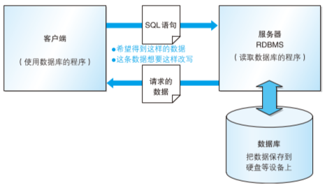
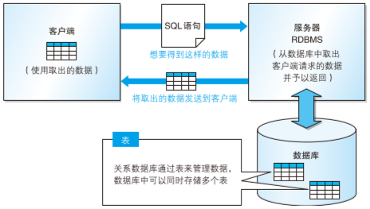

[TOC]

# 数据库和SQL

## 数据库理解

> - 将**大量数据保存**起来，通过计算机加工进行高效访问的数据集合称为 "**数据库（DB）**"
> - 用来**管理数据库的计算机系统称为 “数据库管理系统（DBMS）”**
> - 通过使用 DBMS，多个用户便可安全、简单地大量数据
> - **通过 "关系数据库管理系统（RDBMS）" 进行管理**

**DBMS 种类**

- 层次数据库（Hierarchical Database, HDB）

  把数据通过层次结构（树形结构）方式表现

- 关系数据库（Relational Database，RDB）

  采用由 行和列 组成地二维表来管理数据

  - Oracle
  - SQL Server
  - DB2
  - PostgreSQL
  - MySQL

- 面向对象数据库（Object Oriented Database，OODB）

  把数据以及对数据地操作集合起来以对象为单位进行管理

- XML 数据库（XML Database，XMLDB）

  对 XML 形式的大量数据进行高速处理

- 键值对存储系统（Key-Value Store，KVS）

  单纯保存查询所使用的主键（Key）和值（Value）的组合

## 数据库结构

> - RDBMS：使用 **客户端/服务器** 系统结构
> - 通过从客户端向服务端发送 SQL 语句来实现数据库读写操作
> - 由表示数据的列（字段）和表示一条数据的行（记录）所组成，以记录为单位进行数据读写

### 系统结构

- 服务器：用来接收其他程序发出的请求，并对该请求进行相应处理的程序（软件）

- 客户端：安装该程序的设备（计算机）

- 对数据进行变更等信息通过 **SQL语句** 发送给 RDBMS 服务器

  根据该语句的内容返回所请求的数据，或者对存储在数据库中的数据进行更新

### 表结构

由 **行和列** 组成的二维表来管理数据。用来管理数据的二维表在关系数据库中简称为 **表**

根据 SQL 语句的内容返回的数据同样必须是二维表的形式

- 表的**列**：称为字段，代表了保存在表中的数据项目
- 表的**行**：称为记录，相当于一条数据
- **关系数据库必须以行为单位进行数据读写** 

## SQL 语句定义与规则

- 数据定义（DDL）

    在数据库创建、修改、删除**表/数据库**，为表加入索引（主键、外键、索引）

    - CREATE：创建数据库和表
    - ALTER：修改数据库和表结构
    - DROP：删除数据库和表

- 数据管理（DML）

    在数据库中对**数据**进行增删改查操作

    - SELECT 查询
    - INSERT 新增
    - UPDATE 修改
    - DELETE 删除

- 数据控制（DCL）

    确认或取消对数据库中的数据进行变更

    - COMMIT：确认对数据库中的数据进行变更
    - ROLLBACK：取消对数据库中的数据进行变更
    - GRANT：赋予用户操作权限
    - REVOKE：取消用户的操作权限

### 基本书写规则

- 以分号（；）结尾

- 不区分关键字大小写，但是插入表中的数据是区分大小写的

  - 关键字大写
  - 表明首字母大写
  - 其余（列名等）小写

- 常书的书写方式是固定的

  字符串、日期或数字称为 **常数**

  字符串、日期使用 单引号（ ' ）括起，数字不需要任何符号标识

- 单词需要用半角空格或换行分隔

### 命名规则

只能使用 半角英文字母、数字、下划线（`_`）作为数据库、表和列的名称

- 必须以 半角英文 字母作为开头
- 名称不能重复

### 常见字段类型

- INTEGER：整数类型（不能存储小数）

- FLOAT：浮点数类型

- DECIMAL：精度精确浮点数类型

- CHAR：定长字符串类型，指定该列可存储的字符串长度（最大长度）
  
    **当列中存储的字符串长度达不到最大长度使用半角空格补足**

- VARCHAR：可变字符串类型，当达不到长度不会使用半角空格补足

- DATE：日期类型（年月日），Oracle还包括时分秒
- ...

### 约束设置

约束：对列中存储的数据进行限制或追加条件功能

- NOT NULL：行定义数据不能为空
- PRIMARY KEY：主键，以特定一行数据的列，通过该列取出特定数据
- ...