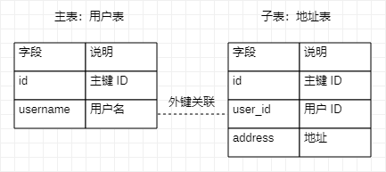

[TOC]

# 字段约束

对列中存储的数据进行限制或追加条件

| 类型 | 关键字 | 说明 |
| --- | --- | --- |
| 非空 | NOT NULL | 不能为 NULL，可以是空字符串 |
| 默认 | DEFAULT | 指定默认值 |
| 唯一 | UNIQUE | 该列唯一，允许空，但仅能有一次 |
| 主键 | PRIMARY KEY | 唯一，且不能为 NULL |
| 外键 | FOREIGN KEY | 表和表之间的关系 |

## 外键约束



```sql
-- 创建表时创建外键约束
CREATE TABLE account_user(
    id INTEGER NOT NULL AUTO_INCREMENT,
    PRIMARY KEY (id)
);

CREATE TABLE account_user_address(
    id INTEGER NOT NULL AUTO_INCREMENT,
    user_id INTEGER NOT NULL,
    PRIMARY KEY (id)
    FOREIGN KEY [key_name](user_id) REFERENCES account_user (id)
);

-- 修改表时增加外键
ALTER TABLE account_user_address ADD FOREIGN KEY key_name(user_id) REFERENCES account_user(id);

-- 删除外键
ALTER TABLE account_user_address DROP FOREIGN KEY key_name;
```

> 外键约束要点
> - 用来约束多个表中数据关系
> - 在 **子表** 定义约束内容
> - 约束关联字段的类型要保持一致
> - 注意添加外键约束后的数据删除问题，当定义约束条件，注意表之间的约束联系